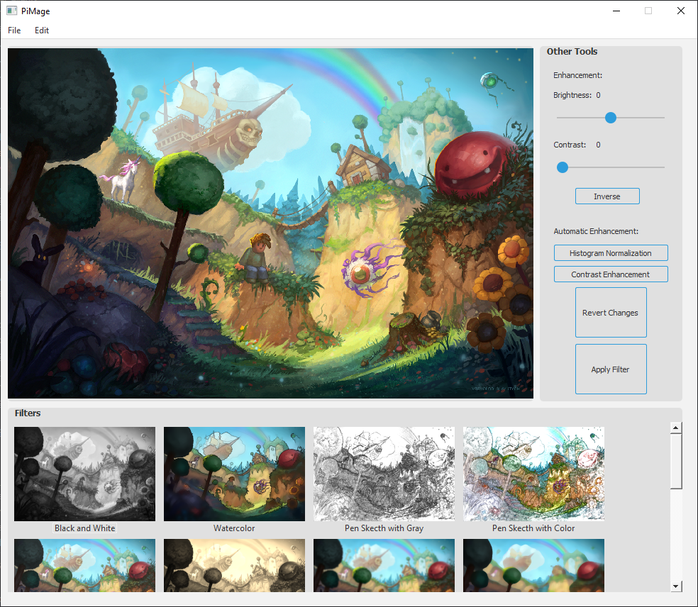

<p float="left">
  
  
  
</p>
</br>

# PiMage

Image Editing Tool with Python and PyQt5

# Tutorial

Python version is 3.8.0 </br>
Needed libs for this project are PyQt5, Scipy, Numpy, Opencv </br>

```
PyQt5 version = 5.15.2
Scipy version = 1.6.0
Numpy version = 1.19.3
Opencv version = 4.4.0
QCrop version = 0.0.1
```

To run this app:

```
python PiMage.py
```

# Screenshot


